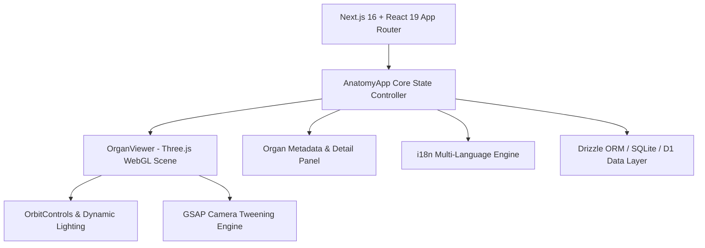

<div align="center">

# 🫀 Human Anatomy Explorer

**Next-Generation Interactive 3D Human Anatomy Visualization Platform**

[](https://nextjs.org/)
[](https://react.dev/)
[](https://threejs.org/)
[](https://greensock.com/)
[](https://tailwindcss.com/)
[](LICENSE)

<p align="center">
  An immersive medical-grade 3D anatomical viewer and educational tool with real-time rendering, smooth GSAP camera transitions, organ-system filtering, and multi-language internationalization.
</p>

</div>

---

## 🌟 Key Features

- **⚡ Real-Time 3D Mesh Rendering**: Interactive organ inspection, orbit controls, dynamic lighting, and depth clipping powered by Three.js and WebGL.
- **🎬 Cinematic Camera Transitions**: Smooth camera panning, zooming, and anatomical target focusing orchestrated with GSAP timeline animations.
- **🔬 In-Depth Organ Intelligence**: High-density medical metadata, physiological breakdown, system classification (Cardiovascular, Respiratory, Digestive, etc.), and functional summaries.
- **🌐 Native Internationalization (i18n)**: Multi-locale support for global medical education and patient communication.
- **🎨 Glassmorphic & Responsive UI**: Modern dark-mode interface built with Tailwind CSS v4 and Lucide React icons.
- **🚀 Cloudflare Workers & Vinext Ready**: Zero-overhead edge execution architecture with optional D1 database and Drizzle ORM integration.

---

## 🏗️ Architecture & Tech Stack



| Layer | Technology | Description |
| :--- | :--- | :--- |
| **Frontend Framework** | Next.js 16 / React 19 | Server & Client components, RSC architecture |
| **3D Graphics** | Three.js (WebGL) | Scene hierarchy, procedural materials, orbital camera |
| **Animation Engine** | GSAP 3.15 | Smooth camera interpolations and UI transitions |
| **Design System** | Tailwind CSS v4 + Lucide | Glassmorphism, clinical dark palette, responsive design |
| **Data Layer** | Drizzle ORM + Cloudflare D1 | Fast relational queries and structured organ schema |
| **Tooling** | Vite 8 + Vinext + TypeScript | Lightning-fast HMR and edge bundle compilation |

---

## 📁 Project Structure

```text
human-anatomy-explorer/
├── app/
│   ├── [locale]/           # Dynamic localization routing
│   ├── components/
│   │   ├── AnatomyApp.tsx  # Main interactive layout & sidebar controller
│   │   └── OrganViewer.tsx # Three.js canvas & WebGL lifecycle manager
│   ├── i18n/               # Translation dictionary and locale definitions
│   ├── lib/                # Utility functions, geometry helpers, and types
│   └── globals.css         # Custom animations and Tailwind styling
├── db/
│   └── schema.ts           # Drizzle database models and organ tables
├── public/                 # 3D assets, textures, and static icons
├── scripts/                # i18n audit and translation export tools
├── tests/                  # End-to-end rendered HTML unit & snapshot tests
├── drizzle.config.ts       # Drizzle Kit migration configuration
├── next.config.ts          # Next.js bundler settings
└── vite.config.ts          # Vinext Cloudflare worker integration
```

---

## 🚀 Quick Start Guide

### Prerequisites
- **Node.js**: `>=22.13.0`
- **Package Manager**: `npm`, `pnpm`, or `yarn`

### 1. Clone & Install
```bash
git clone https://github.com/the-forgotten-polymath/human-anatomy-explorer.git
cd human-anatomy-explorer
npm install
```

### 2. Run Locally
```bash
npm run dev
```
Navigate to `http://localhost:3000` to launch the interactive 3D explorer.

### 3. Production Build & Test
```bash
# Build optimized production bundle
npm run build

# Run automated tests
npm test

# Run ESLint validation
npm run lint
```

---

## 🎯 Roadmap

- [x] High-precision 3D organ meshes and interactive rotation
- [x] Multi-language dictionary and locale selector
- [x] GSAP-driven organ focus zoom & reset animations
- [ ] Cross-sectional slice tool for axial/sagittal plane inspection
- [ ] AR/VR WebXR immersive mode for VR headsets
- [ ] Interactive pathology simulation and disease state overlays

---

## 📄 License

Distributed under the **MIT License**. See `LICENSE` for more information.
